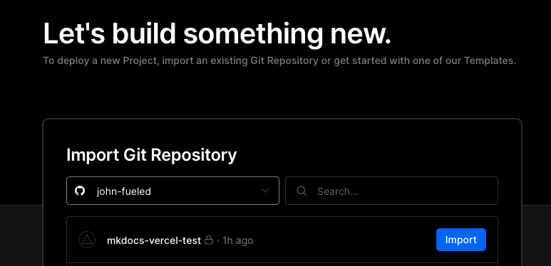
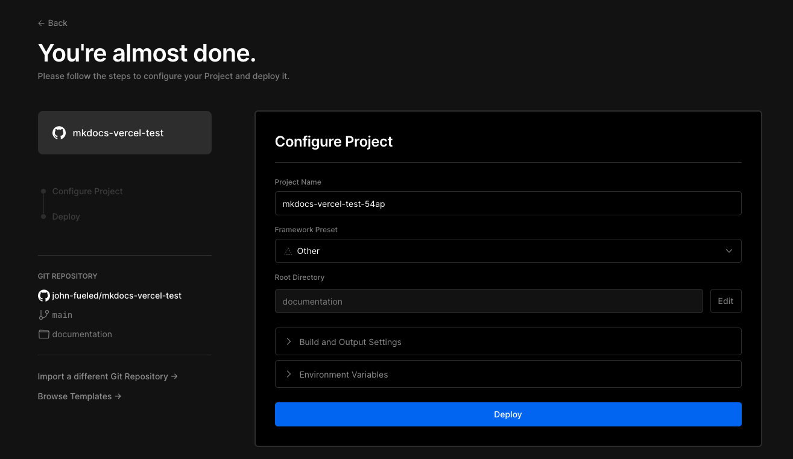
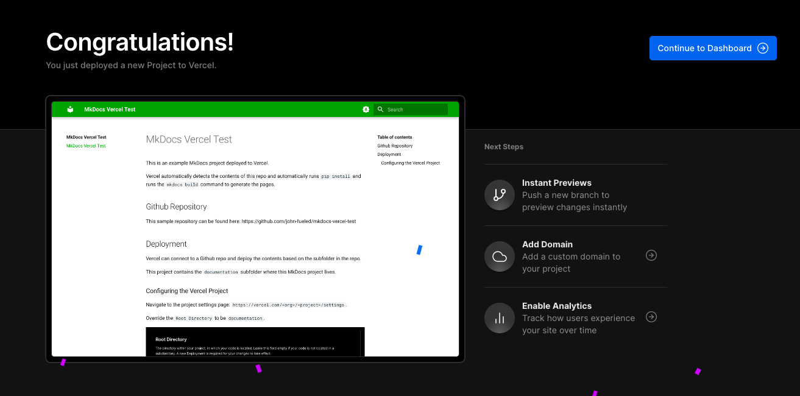
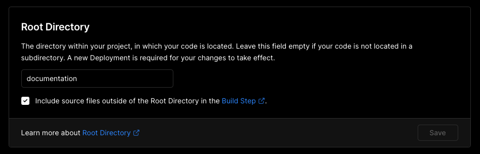

# Demo

This is an example MkDocs project deployed to Vercel.

## Project Structure

Vercel can connect to a Github repository and deploy the contents based on a given subfolder within the repository.

This project contains the `documentation` subfolder where the MkDocs content and config files live.

Vercel automatically detects the contents of this repository, runs `pip install` and the `mkdocs build`, in order to generate the pages that will be hosted.

## Github Repository

This sample repository can be found here: [https://github.com/john-fueled/mkdocs-vercel-test](https://github.com/john-fueled/mkdocs-vercel-test)

## Create Vercel Project

Create a new Vercel project by navigating to: [https://vercel.com/new](https://vercel.com/new)

Connect Github and choose to import a repository.

Configure the Project settings by setting the Root Directory to `documentation`

Click "Deploy" and you now have fully connected documentation from your Github repo to the hosted Vercel site.

## Configuring an existing Vercel Project

Navigate to the project settings page: `https://vercel.com/<org>/<project>/settings`.

Override the `Root Directory` to be `documentation`.

Optional: Toggle the "Include source files outside of the Root Directory in the Build Step" off if you only need the contents in `/documentation`.

## Vercel Preview Links

When a PR is open, Vercel will also build a preview link of the documentation.
